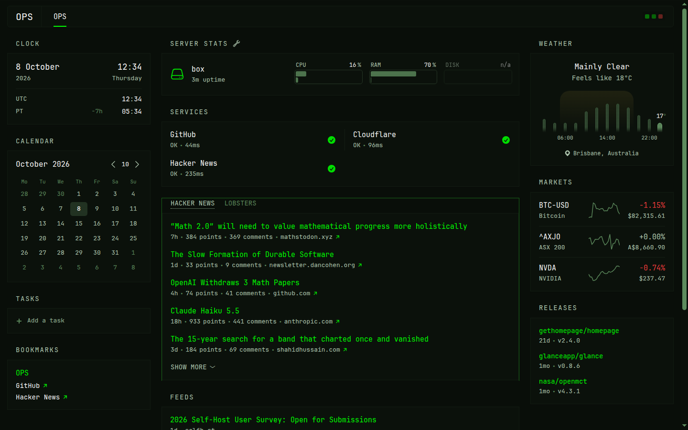

# Ops Centre

A personal ops command centre with a phosphor-green CRT / terminal look — a fork of [Glance](https://github.com/glanceapp/glance) for Zac Judson (Brisbane, Australia).

Glance's Go backend, YAML layout, and widgets stay intact so upstream merges stay easy. This fork's first pass is mostly **config, theme, and branding**.



## Quick start

From the repo root (requires [Go](https://go.dev/dl/) ≥ 1.23):

```bash
go run . --config config/glance.yml
```

Open **http://localhost:8080** — you should land on the OPS page (monospace, square panels, scanlines, Brisbane weather, clocks, monitors, feeds).

### Docker Compose (optional)

```bash
docker compose up --build -d
```

Same URL: **http://localhost:8080**. Config and theme are bind-mounted from `config/` and `assets/`.

## What's included

| Path | Role |
| ---- | ---- |
| [`config/glance.yml`](config/glance.yml) | OPS dashboard layout (theme, branding, widgets) |
| [`assets/terminal.css`](assets/terminal.css) | Phosphor-green CRT stylesheet |
| [`docs/INSPIRATION.md`](docs/INSPIRATION.md) | Roadmap ideas from Arwes & m4tt72/terminal |
| [`docker-compose.yml`](docker-compose.yml) | Container boot path |
| [`.env.example`](.env.example) | Env-var placeholders (no secrets in git) |

## Customising

- **Layout & widgets** — edit `config/glance.yml`. Full widget reference: [docs/configuration.md](docs/configuration.md).
- **Look** — tweak HSL theme colours in the config `theme:` block, or edit `assets/terminal.css`.
- **Branding** — `branding.logo-text`, `app-name`, and `custom-footer` in the config.
- **Secrets / private URLs** — copy `.env.example` → `.env`, then use `${VAR_NAME}` in YAML. Never commit real keys.
- **Monitors** — replace the public service checks with your own hosts; see the commented example in the config.

Auto-reload applies when you save the config (no restart needed for most YAML edits).

## Roadmap

This pass ships the terminal OPS look and repo framing only. Planned borrowings (HUD frames, typed command prompt, theme switching, etc.) are sketched in **[docs/INSPIRATION.md](docs/INSPIRATION.md)**. Prefer CSS/assets and thin JS over deep Go changes where possible.

## Upstream

Built on [glanceapp/glance](https://github.com/glanceapp/glance). Upstream docs that still apply:

- [Configuration](docs/configuration.md)
- [Themes](docs/themes.md)
- [Preconfigured pages](docs/preconfigured-pages.md)
- [Community widgets](https://github.com/glanceapp/community-widgets)

## License

This project remains under the [GNU Affero General Public License v3.0](LICENSE), same as upstream Glance. Keep the license and attribution when you distribute or host a modified version.
